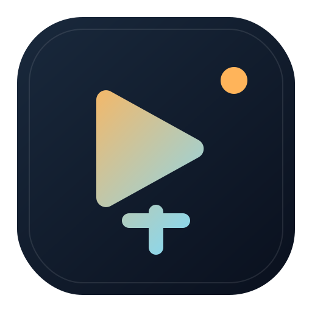

# YT-DLP Studio



YT-DLP Studio 是一个给 `yt-dlp` 准备的桌面控制台，把链接下载、`cookies.txt` 选择和本地媒体后处理整理到同一个界面里。

English summary is included below. GitHub README 本身不支持真正的界面式语言切换，所以这里改成顺排双语说明，不再靠跳转锚点假装切换。

## 下载

- [前往 GitHub Releases 下载](https://github.com/Yifo98/YT-DLP-Studio/releases/latest)
- Windows：优先下载 `YT-DLP Studio-1.0.1-win.zip`，也可直接使用便携版 `YT-DLP Studio 1.0.1.exe`
- macOS：优先下载 `YT-DLP Studio-1.0.1-arm64-mac.zip`

当前标准发布包目标就是“解压即用”。

当前 `macOS` 与 `Windows` 分享包都已经内置：

- `yt-dlp`
- `ffmpeg`
- `ffprobe`
- `deno`

只有当某个发布包明确标注为 `Lite`、`tools not bundled` 或 `UI-only` 时，才需要额外准备环境。

## macOS 使用说明

macOS 版本现在优先使用应用包内置工具，同时仍保留系统环境兜底：

1. 应用包内自带 `tools/`
2. 系统环境里已安装的 `yt-dlp`、`ffmpeg`、`ffprobe`、`deno`

如果你运行的是开发版或 UI-only 版本，推荐先安装：

```bash
brew install yt-dlp ffmpeg deno
```

如果你更习惯 Conda，也可以把这些工具放进同一个环境里，应用会自动尝试从该环境的 `bin/` 目录读取。

## Windows 使用说明

Windows 现在同时提供两种成品：

- `YT-DLP Studio-1.0.1-win.zip`
- `YT-DLP Studio 1.0.1.exe`

两者都已经内置运行所需工具，不需要额外安装 Conda、ffmpeg、yt-dlp 或 Deno。

## 功能概览

- 桌面控制台：批量链接下载、格式选择、4K 画质上限、实时进度
- 媒体工具台：音轨分离、字幕导出、流信息查看、字幕整理
- Cookies 管理：导入本地 `cookies.txt` 处理登录态或会员内容

## 1.0.1 亮点

- 新增真正可分享的 `macOS arm64` 解压即用包
- 媒体工具台新增 OpenAI-compatible 字幕整理能力
- 支持模型拉取、连接测试、批量整理、自定义服务保存
- 下载台补齐环境刷新、链接清空、多行粘贴去重
- 主项目根目录只保留一个启动器，日常启动更直接

## Cookies 推荐

如果目标站点需要登录态或会员权限，推荐先在浏览器导出 `cookies.txt` 再放进本地 `cookies/` 目录。

推荐浏览器扩展：

- [Get cookies.txt LOCALLY](https://chromewebstore.google.com/detail/get-cookiestxt-locally/cclelndahbckbenkjhflpdbgdldlbecc)

## Windows 首次运行提示

当前 Windows 发布包还没有做代码签名，第一次在其他电脑上运行时，可能会看到 SmartScreen 的“Windows 已保护你的电脑”提示。

这时候点击：

1. `更多信息`
2. `仍要运行`

就可以继续启动。

后续会继续完善签名和发布体验。

## 发布说明

更详细的 Win / Mac 发布文案、下载资产命名和环境兜底说明，请看：

- [发布说明 / Release Guide](docs/RELEASES.md)
- [1.0.1 发布文案](docs/release-1.0.1.md)

---

## English

YT-DLP Studio is a desktop control room for `yt-dlp`, combining downloads, `cookies.txt` selection, and local media post-processing in one interface.

## Download

- [Download from GitHub Releases](https://github.com/Yifo98/YT-DLP-Studio/releases/latest)
- Windows: prefer `YT-DLP Studio-1.0.1-win.zip`, or use the portable `YT-DLP Studio 1.0.1.exe`
- macOS: prefer `YT-DLP Studio-1.0.1-arm64-mac.zip`

The standard shared builds are now intended to be plug-and-play.

Both current `macOS` and `Windows` shared packages already bundle:

- `yt-dlp`
- `ffmpeg`
- `ffprobe`
- `deno`

Only install tools manually when an asset is explicitly labeled as `Lite`, `tools not bundled`, or `UI-only`.

## macOS Notes

The macOS build now prefers bundled tools while still keeping a system fallback:

1. A bundled `tools/` directory
2. Your system environment, including Homebrew and Conda locations

For local development or a UI-only build on macOS, the recommended setup is:

```bash
brew install yt-dlp ffmpeg deno
```

## Windows Notes

Windows now ships in two forms:

- `YT-DLP Studio-1.0.1-win.zip`
- `YT-DLP Studio 1.0.1.exe`

Both already include the required runtime tools, so users do not need to install Conda, ffmpeg, yt-dlp, or Deno separately.

## Highlights

- Desktop control room for link-based downloads, job tracking, and quality caps up to 4K
- Media tools window for audio extraction, subtitle export, stream inspection, and subtitle cleanup
- Local `cookies.txt` support for signed-in or member-only content

## 1.0.1 Highlights

- Added a shareable macOS arm64 plug-and-play package
- Added Windows x64 zip and portable exe builds
- Packaging now excludes cookies, user data, and local model configs
- Added OpenAI-compatible subtitle cleanup in the media tools window
- Added model fetching, connection testing, batch cleanup, and custom provider presets
- Improved runtime refresh, link clearing, multiline paste dedupe, and launcher cleanup

## Cookies Recommendation

If a target site requires a signed-in or member session, export `cookies.txt` from your browser and place it into the local `cookies/` directory first.

Recommended browser extension:

- [Get cookies.txt LOCALLY](https://chromewebstore.google.com/detail/get-cookiestxt-locally/cclelndahbckbenkjhflpdbgdldlbecc)

## Windows First-Run Note

The current Windows builds are not code-signed yet, so SmartScreen may show a warning the first time the app is launched on another PC.

If that happens, click:

1. `More info`
2. `Run anyway`

The app should then start normally.

## Release Guide

For release wording, asset naming, and dependency fallback notes, see:

- [Release Guide](docs/RELEASES.md)
- [1.0.1 Release Copy](docs/release-1.0.1.md)
